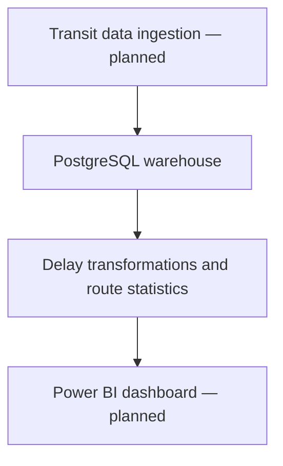

# Transport Insights

An early-stage data engineering project for analysing public-transit delays by route, time and weekday.

**Python · PostgreSQL · SQLAlchemy · pandas · pytest**

## Current scope

The repository contains SQL warehouse schemas, database configuration and connection utilities, delay transformation code, tests and a GitHub Actions workflow.

The ingestion and API modules are currently placeholders. **Airflow orchestration and the Power BI dashboard are planned**, so this is not yet an end-to-end transit analytics platform.

## Intended workflow



## Setup

```bash
git clone https://github.com/AlirezaFarkhondeh2k3/transport-insights.git
cd transport-insights
python -m venv .venv
```

Activate the environment:

```bash
# macOS / Linux
source .venv/bin/activate
# Windows PowerShell
.venv\Scripts\Activate.ps1
```

Install dependencies and run the existing tests:

```bash
pip install -r requirements.txt
pytest
```

Database configuration reads `DB_HOST`, `DB_PORT`, `DB_USER`, `DB_PASSWORD` and `DB_NAME`. Configure these for your local PostgreSQL instance.

## Repository contents

| Path | Purpose |
| --- | --- |
| `db/schema/` | Date, route and stop dimensions; delay facts and route statistics |
| `db/apply_schema.py` | Schema setup script |
| `src/transport_insights/db/` | Database connection utilities |
| `src/transport_insights/transform/` | Delay transformations |
| `src/transport_insights/ingest/` | Ingestion placeholder |
| `src/transport_insights/api/` | API placeholder |
| `tests/` | Import and delay transformation tests |
| `.github/workflows/` | CI configuration |

## Next milestones

1. Implement ingestion from a documented public-transit dataset.
2. Connect ingestion, transformation and warehouse loading.
3. Add a dashboard and demonstrate route-delay analysis with reproducible sample data.
